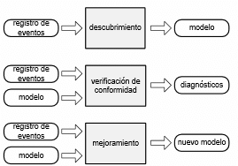

# CELONIS

Software para process mining _([PM](/others/glossary.md#p))_

Para el desarrollo de en esta herramienta se usan conceptos de [gestión del rendimiento en la implementación de BPM](/knowledge/hard-skills/Maestría/Gestión-rendimiento-implementación-BPM/README.md)

En particular se usará el siguiente ciclo de vida de BPM.

## Los tres principales tipos de process mining

Los Event Logs pueden conducir a tres tipos de process mining:

### Discovery

Es cuando toma los Event logs y produce un modelo sin necesitar ningún tipo de información del front.

El proceso de discovery es la técnica mas prominente de process mining.

### Conformance

Este proceso hace una comparativa entre el modelo y los event logs del mismo proceso para chequear si el uso real del proceso es grabado conforme se predefinió y viceversa.

### Enhancement

En este proceso la idea principal es extender o mejorar un modelo de proceso usando la información actual de los event logs grabados. Con lo anterior se busca alinear el proceso a la realidad.

El uso de event logs por instancia, extiende el modelo para identificar cuellos de botella, niveles de servicio y frecuencias de uso en peticiones.

## Características de los process mining

Los tres tipos de procesos se pueden distinguir por el tipo de entradas y su resultado esperado.

## Process mining desde la perspectiva organizacional

Dado que los datos recolectados en los Event logs, buscan la eficiencia del proceso, de la misma forma el producto o servicio objeto del proceso se irá incrementando, por lo que al final llega a necesitarse un _[ERP](/others/glossary.md#e)_ Este software ayuda a manejar el crecimiento de peticiones, mantiene un track de cada petición y de cada inventario y organiza sus recursos como maquinarias y personal. Este software soporta y controla las partes reales del negocio.

Todo lo anterior ocurre gracias a los tres tipos de process mining.

En resumen el process mining ayuda al crecimiento de una compañía.

## Niveles de abstracción de mapas de proceso

Los modelos de proceso provienen de datos que a su vez provienen de la vista de la realidad.

De esta manera se obtiene el primer nivel de abstracción _Abstracción Intencionada_.

Para entender los siguientes niveles es necesario considerar que los mapas obtenidos no son perfectos y siempre muestran una parte de la información y no muestra todo el panorama.

Por lo tanto los procesos se centran o enfatizan en casos de uso relevantes o particulares, siendo así especiales para algo en especifico.

Por ejemplo puede haber mapas de procesos para: control de flujo, flujo de datos, throughput time, Cuellos de botella, recursos, costos, etc. Cabe destacar que cada uno de estos mapas tiene un nivel diferente de granularidad o precisión.

### Nivel estratégico

Se enfocan en políticas y pasos a seguir que garantizan la producción en largos periodos de tiempo.

### Nivel Táctico

Aquí las decisiones tienen un efecto en el mediano periodo de tiempo.

## Nivel Operacional

En este nivel, las decisiones tienen un efecto inmediato.

## Características de los mapas de proceso

Es relevante indicar que los mapas cartográficos digitales tienen posibilidades de acercar o alejar el area para visualizar mayores detalles o ver todo el mapa de forma genérica.

De la misma forma un modelo o un mapa de proceso se puede ver desde la perspectiva global o desde las perspectiva de un sub-proceso.

De la misma forma un mapa digital presenta colores para diferentes areas como parques, lagos, avenidas, calles, etc. O también lineas de diferente grosor para calles principales o secundarias y terciarias.

Igualmente en los mapas de proceso en Celonis, se puede observar de forma gruesa, los procesos mas relevante o que tienen cuellos de botella y en lineas delgadas o punteadas las de menos frecuencia.

## Características

Celonis es un software para hacer process mining gratuito, que no requiere instalación y es muy fácil de trabajar en él esencialmente es "_plug and play_".

En la parte técnica Celonis usa [PQL](/others/glossary.md#p) para la comunicación con bases de datos. Hbw.FF<2N&$&qE
